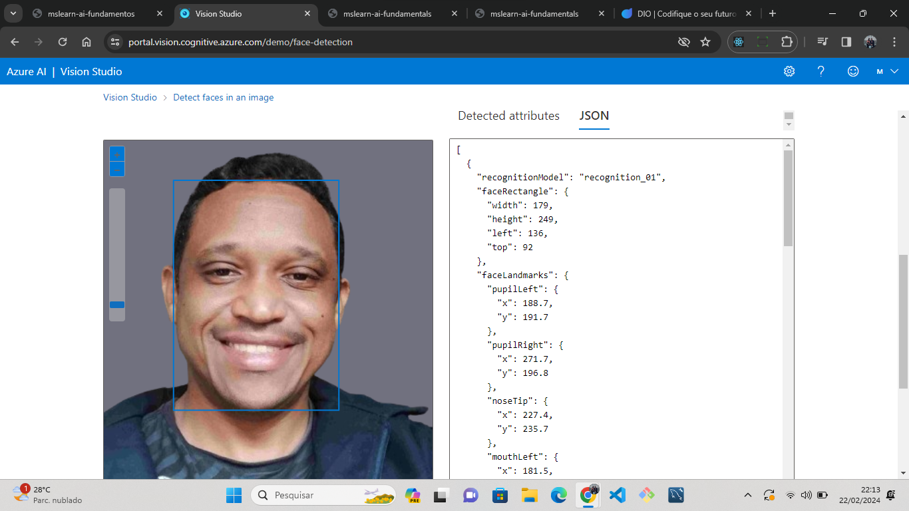

# Azure AI Vision: Guia de Utilização

Olá! Neste guia, vou te mostrar como utilizei o Azure AI Vision para análise de imagens, leituras de documentos e descrição de imagens. Vamos lá!

## 1. Criação do Recurso de Serviços de IA do Azure

- No portal do Azure, criei um novo resource group com o nome exclusivo.
- Em seguida, criei um recurso de serviços de IA do Azure dentro desse resource group.
- Configurei o recurso com as seguintes configurações: região Leste dos EUA, nível de preços Padrão S0, etc.
- Aguardei a conclusão da implantação do recurso.

## 2. Conexão do Recurso ao Vision Studio

- Acessei o Vision Studio e fiz login com minha conta.
- Na página inicial, selecionei o recurso que criei no passo anterior e o marquei como o recurso padrão.

## 3. Geração de Legendas para uma Imagem

- No Vision Studio, na guia Análise de imagem, selecionei o bloco "Adicionar legendas às imagens".
- Baixei a imagem fornecida e a carreguei no Vision Studio.
- Observei a legenda gerada no painel Atributos detectados à direita da imagem.

## 4. Marcação de Imagens

- Na guia Análise de imagem, selecionei o bloco "Extrair tags comuns de imagens".
- Escolhi o modelo e idioma desejados e carreguei a imagem para revisar as tags extraídas.

## 5. Detecção de Objetos

- Na guia Análise de imagem, selecionei o bloco "Detectar objetos comuns em imagens".
- Carreguei a imagem e observei a lista de objetos detectados e suas pontuações de confiança.

## 6. Limpeza

- Para evitar custos desnecessários, acessei o portal do Azure, selecionei o grupo de recursos e excluí os recursos não mais necessários.

## Próximos Passos

[]

## Saiba Mais

Para entender melhor sobre o serviço de Detecção Facial da IA do Azure, confira [O que é o serviço de Detecção Facial da IA do Azure?](https://learn.microsoft.com/pt-br/azure/ai-services/computer-vision/overview-identity).

Para explorar mais sobre o Azure AI Vision, confira a página oficial [Azure AI Vision](https://azure.microsoft.com/services/cognitive-services/computer-vision/).

[Linkedin](https://www.linkedin.com/in/marcelino-albuquerque-developer/)
